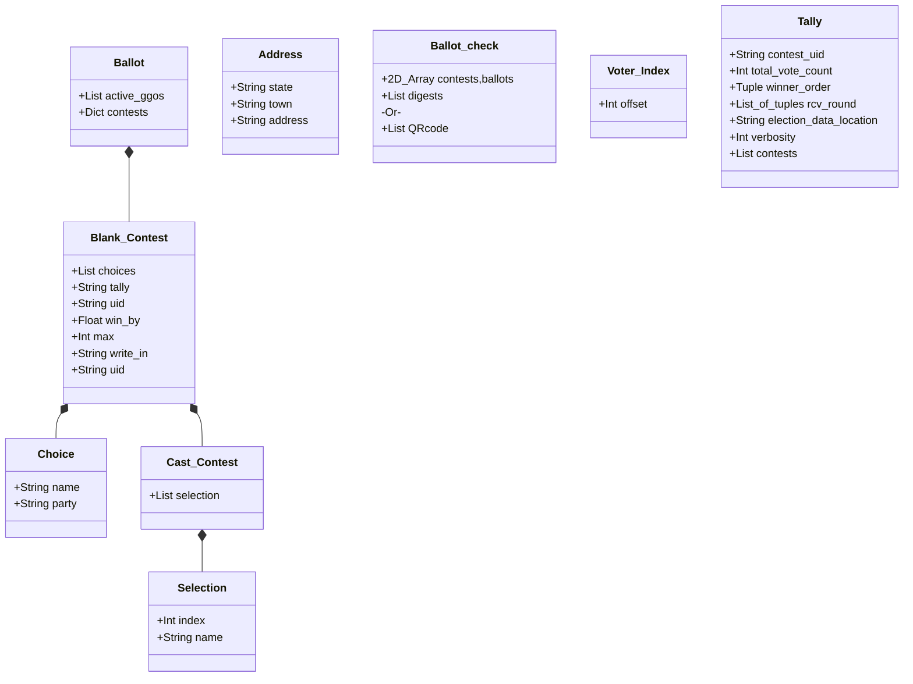

```mermaid
classDiagram
  Blank_Contest *-- Choice
  Ballot *-- Blank_Contest
  Blank_Contest *-- Cast_Contest
  Cast_Contest *-- Selection

  class Address {
    +String state
    +String town
    +String address
  }

  class Choice {
    +String name
    +String party
  }

  class Selection {
    +Int index
    +String name
  }

  class Blank_Contest {
    +List choices
    +String tally
    +String uid
    +Float win_by
    +Int max
    +String write_in
    +String uid
  }

  class Cast_Contest {
    +List selection
  }

  class Ballot {
    +List active_ggos
    +Dict contests
  }

  class Ballot_check {
    +2D_Array contests,ballots
    +List digests
    -Or-
    +List QRcode
  }

  class Voter_Index {
    +Int offset
  }

  class Tally {
    +String contest_uid
    +Int total_vote_count
    +Tuple winner_order
    +List_of_tuples rcv_round
    +String election_data_location
    +Int verbosity
    +List contests
  }

```
