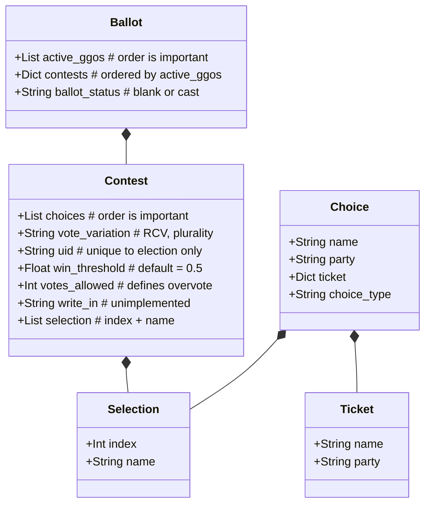

```mermaid
classDiagram
  Choice *-- Selection
  Ballot *-- Contest
  Contest *-- Selection
  Choice *-- Ticket

  class Choice {
    +String name
    +String party
    +Dict ticket
    +String choice_type
  }

  class Selection {
    +Int index
    +String name
  }

class Ticket {
    +String name
    +String party
}

  class Contest {
    +List choices # order is important
    +String vote_variation # RCV, plurality
    +String uid # unique to election only
    +Float win_threshold # default = 0.5
    +Int votes_allowed # defines overvote
    +String write_in # unimplemented
    +List selection # index + name
  }

  class Ballot {
    +List active_ggos # order is important
    +Dict contests # ordered by active_ggos
    +String ballot_status # blank or cast
  }
```
